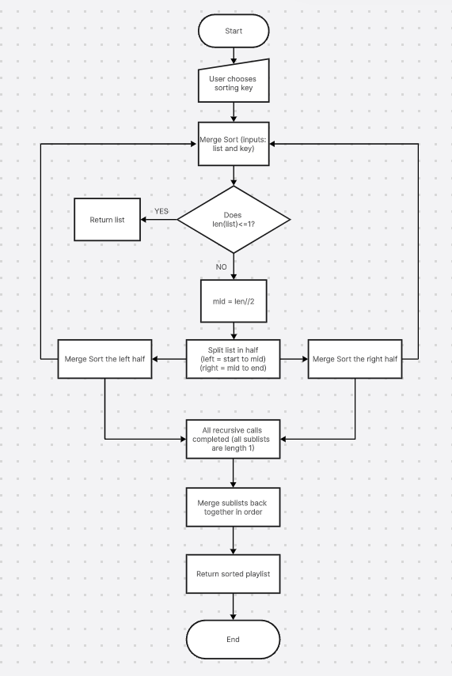

# Playlist Vibe Builder

Data: a list of songs (title, artist, energy score 0–100, duration). 

User action: choose a sorting key (e.g., energy or duration) and sort the playlist. 

App output: show the sorted playlist and animate comparisons/moves so the re-ordering is easy to follow.\

## Demo:

https://github.com/user-attachments/assets/70bbbd08-2744-4f99-83b4-33e4f951d430

## Why Merge Sort?

I chose Merge Sort because it is stable, while Quick Sort is typically not. Stability is important for this program because if there is a tie between songs for the chosen sorting key, we want to keep the original order of the songs. Using Merge Sort can also be safer than Quick Sort because there is no risk of the O(n^2) worst case scenario for time complexity. This is especially important to consider because Spotify can have playlists up to 10000 songs long.

## Preconditions:

The songs in the list must have the following information in order for the program to work: 

- Title
- Artist
- Duration
- Energy Score (must be 0-100 & int)

The list must also have at least one element, otherwise nothing is being sorted

The app ensures that these are met by checking for all four pieces of information for each song, ensure that none of them are blank, then checking if the duration and energy score are positive integers, and that the energy score is between 0 and 100. The app also has a base case check for lists of length 0 or 1.

## What The User Sees:

The user is presented with a list of songs, whcih they can add to, a drop down menu of sorting keys, and a button that once pressed sorts the playlist. After this button is pressed, they are presented with the sorted list on the left and the steps for the sorting algorithm on the right. 

## Computational Thinking:

Decomposition:

- Each song is a dictionary with key value pairs for title, artist, length, etc..
- User picks a sorting key based on the information from the songs
- Merge Sort:
  - Repeatedly split song list into sublists until all sublists are of length 1
  - Combine the sublists in the opposite order they were broken down, sorting each sublist (least -> greatest) at each step
  - Return newly sorted list
- Visual demonstration of the sorting

Pattern Recognition:

- Each sublist is created by splitting the previous (sub)list in half using mid = len(list)//2
- When merging sublists back together, the smallest number will preceed the larger one

Abstraction:

- User Sees: 
  - List of songs
  - Possible sorting keys (program will offer options or drop down menu)
  - Song list before and after sorting
  - Steps for the sorting of the list
- User Doesn't See:
  - Code behind 

Algorithm Design:

- Input: User chooses key to sort playlist by
- Processing: Merge Sort organizes the playlist
- Output: Step by step visual display,in Gradio, of the playlist being merge sorted, until the list is fully sorted

## Step to Run Locally

1. Clone the repository: 
    git clone https://github.com/TopFloorBoss77/CISC121-Project-EthanWigston.git
2. Navigate to the project folder: 
    cd CISC121-Project-EthanWigston
3. Install dependencies:
    pip install -r requirements.txt
4. Run the app:
    python app.py
5. Open brower and go to `http://127.0.0.1:7860`
    **Requirements:** Python 3.8 or higher

Requirements: gradio (see requirements.txt in GitHub)

## Hugging Face link:

https://huggingface.co/spaces/EthanEthanEthan/playlist-vibe-builder

## Testing

| Test Case               | Input                                 | Expected Output                                            | Actual Output                                              | Pass? |
| ----------------------- | ------------------------------------- | ---------------------------------------------------------- | ---------------------------------------------------------- | ----- |
| Normal sort (both keys) | 15 song starting lisit                | sorted low -> high based on key                            | sorted low -> high based on key                            | PASS  |
| User adds song to list  | 16 song list                          | sorted low -> high based on key                            | sorted low -> high based on key                            | PASS  |
| No songs                | arbitrary sorting key                 | "Your playlist is empty. Please add at least one song."    | "Your playlist is empty. Please add at least one song."    | PASS  |
| 1 song                  | arbitrary sorting key                 | List remains same, 'no sort' statement in step-by-step box | List remains same, 'no sort' statement in step-by-step box | PASS  |
| Empty field             | Song, Artist, [empty] , duration      | "Duration must be a whole number" error code               | "Duration must be a whole number" error code               | PASS  |
| Missing field           | Song, Artist, Energy Score, [missing] | "Line 2 has 3 field(s) but 4 are needed"                   | "Line 2 has 3 field(s) but 4 are needed"                   | PASS  |
| Non-numeric energy      | "Song, Artist, abc, 200"              | Error on line number                                       | Error shown                                                | PASS  |
| Energy out of range     | Energy = 150                          | error "Energy must be between 0 and 10"                    | error "Energy must be between 0 and 10"                    | PASS  |
| Duration = 0            | Duration = 0                          | "Duration must be a positive number" error                 | "Duration must be a positive number" error                 | PASS  |
| Two songs same energy   | Both energy = 70                      | Original order preserved                                   | Correct                                                    | PASS  |

## Author & AI Acknowledgment

Author: Ethan Wigston

Course: CISC121 W26 @ Queen's university

AI LEVEL 4:

- Used Claude to develop the code  and guide the structure of the project

- Claude was also used to help set up the GitHub and Hugging Face

- Claude was used to debug the code

- Claude developed the GUI and implemented suggested improvements

Claude chat link: [Claude](https://claude.ai/share/e833d186-cd0d-4dea-812a-ed40dd23d2c8) 

## 
